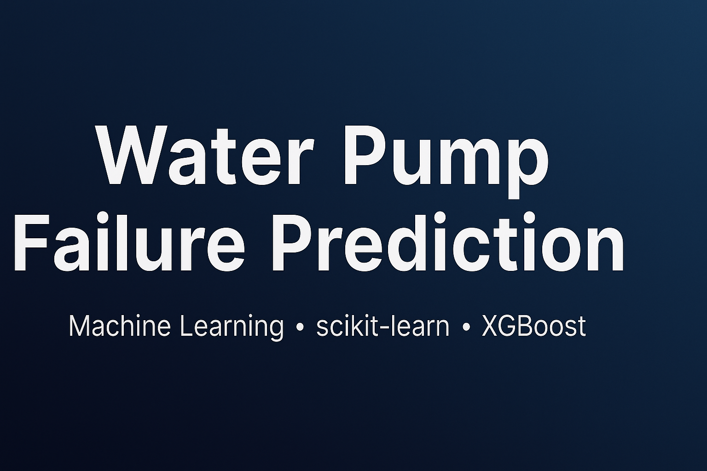

  

# Water Pump Failure Prediction

Supervised machine learning project to predict the functional status of water pumps (inspired by DrivenData’s “Pump it Up”).  
Focus on clean feature engineering, robust evaluation and reproducible training pipelines.

## Problem
Given pump metadata (location, construction year, management, etc.), predict whether a pump is:
- **functional**
- **functional needs repair**
- **non functional**  
(You can adapt to binary if needed.)

## Dataset
- Structured tabular data (CSV/Excel).  
- Typical columns: `amount_tsh`, `date_recorded`, `funder`, `installer`, `gps_height`, `longitude`, `latitude`, `wpt_name`, `basin`, `lga`, `extraction_type`, `management`, `payment`, `water_quality`, `quantity`, `source`, `waterpoint_type`, etc.

##  Approach
- **Preprocessing:** missing values, categorical encoding (One-Hot/Target), date features, geospatial bins, outlier handling.
- **Models:** Logistic Regression / Random Forest / XGBoost.
- **Evaluation:** stratified split, cross-validation, class imbalance handling (class weights or resampling), metrics (Accuracy, Macro-F1).

## Results
- Report metrics on validation and a confusion matrix.
- Feature importance from tree-based models (e.g., XGBoost).

## Technical Report 
waterpumps_report.html

##Author: Judith Martínez
— Portfolio · Email

